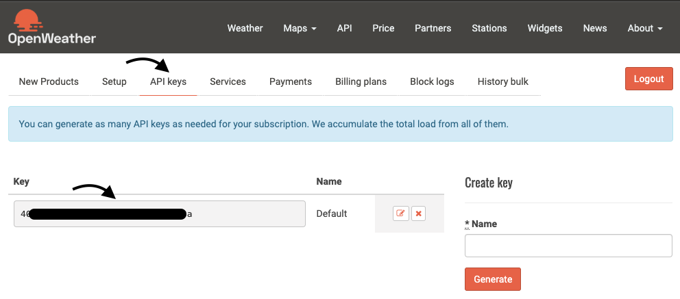
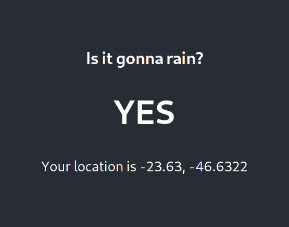

# Tenki (天気) Channel :cloud:

Tenki Channel is a tech demo that puts [Kogito](https://kogito.kie.org/), [Camel](https://kogito.kie.org/), [Quarkus](https://kogito.kie.org/) and OpenShift together to showcase some examples using those components.

Tenki (天気) in Japanese means _weather_. :-D

# TLDR

- Works on OCP 3.11 and 4.x.
- Requires deploy of three pieces: two back-end services (kogito and camel) and one front-end UI.
- Requires a free account at [openweathermap](https://openweathermap.org/api). Grab your API Key to use on the demo deployment.
- Quickest way to have this demo up and running is to deploy on Openshift using the provided templates. You won't have the full experience though. Or, you can have the experience of deploying it with Kogito Operator (or using the Kogito CLI).

## TLDR Deploy back-end via template

```bash
# clone this repo
$ git clone https://github.com/ricardozanini/tenkichannel.git
$ cd tenkichannel
$ oc new-project tenkichannel
$ oc create -f openshift/rain-forecast/templates/rain-forecast-backend.yaml
# grab your API key on https://openweathermap.org/api
$ oc new-app --template=rain-forecast-demo -p NAMESPACE=tenkichannel -p OPENWEATHER_API_KEY=<your-api-key>
# create the UI template
$ oc create -f openshift/rain-forecast/templates/rain-forecast-ui.yaml
```

## TLDR Deploy back-end (using Kogito Operator)

Install [Kogito Operator](https://github.com/kiegroup/kogito-cloud-operator) and then:

```bash
# clone this repo
$ git clone https://github.com/ricardozanini/tenkichannel.git
$ oc new-project tenkichannel
# Deploy Kogito App
$ oc create -f openshift/rain-forecast/operator/rain-forecast-kogitoapp.yaml
# Deploy Camel Service (REPLACE YOUR OPENWEATHER KEY)
$ oc new-app https://github.com/ricardozanini/tenkichannel --name=weather-api-gateway --context-dir=weather-api-gateway -e JAVA_OPTIONS="-Dorg.tenkichannel.weather.api.gateway.openweathermap.api_key=<your_api_key>" --docker-image=docker.io/fabric8/s2i-java:latest-java11 -l forecast=service
```

## TLDR; Deploy front-end

Set the BACKEND_ROUTE variable with the route of your rain-forecast service i.e. https://rain-forecast-tenkichannel.apps.your-cluster.com

```
# create the UI template
$ oc create -f openshift/rain-forecast/templates/rain-forecast-ui.yaml
# create the UI application using as parameter the rain-forecast route that were generated in the above section
$ oc new-app --template=rain-forecast-demo-ui -p BACKEND_ROUTE=<service-route>
```

Access the front-end application using its route. 

# Detailed Instructions

## Rain Forecast - Is it gonna rain? :umbrella:

In this use case we have two back-end services working together to answer a simple question: "Is it gonna rain on my location?".

The first service, [**Rain Forecast Process**](rain-forecast-process) uses the process automation framework, Kogito, to automate a forecast process that will call the [**Weather API Gateway**](weather-api-gateway). Based on the weather forecast results, calculated by a decision rule, the process will give you the answer.

The Weather API Gateway is a Camel service that hides the external weather service and exposes the domain data that we're interested in. The gateway implements (in a certain level) the [API Gateway pattern](https://microservices.io/patterns/apigateway.html).

Both back-end services are backed by the Quarkus framework. This means that you can run in native code in the cloud.

There is also a front-end UI which displays in a friendly way for users and shows one possible to consume the back-end services.

## Main Pre-reqs

1. You need to create a free account on [openweathermap](https://openweathermap.org/api), login and copy the API Key to use on the demo deployment;
2. oc client available (in case you want to deploy on [Openshift](https://docs.openshift.com/container-platform/4.1/welcome/index.html));

### Running  locally

To make both Kogito and Camel services work locally, read the guides ([here](rain-forecast-process) and [here](weather-api-gateway)) and have both services up and running. You should call the Rain Forecast Process at the `rainforecast` endpoint to see it in action. 

### Deploying on OpenShift ⭕️

You should either use templates OR the [Kogito Operator](https://github.com/kiegroup/kogito-cloud-operator) to deploy the Rain Forecast Application. 

* Deploy using templates: The quicker method to have the demo up and running. It takes the pre built images from Quay and deploy them into your cluster.

* Deploy using Kogito Operator: Experience how it is to deploy and use the Kogito Operator to deliver an application. It builds the application for you from this master branch. It's worth taking a look to get your hands dirty on the operator way of doing things on OpenShift.

This demo runs on OCP 3.11 and 4.x.

#### Open Weather API

You will need an API Key on Open Weather. To get it follow these steps:
1. Create a free account and Log in
2. Go to API Keys menu and you will be able to see your default Key (or add other keys).



#### Option 1: Using Templates

To deploy the Rain Forecast demo on your OpenShift cluster, follow these steps:

```bash
# clone this repo
git clone https://github.com/ricardozanini/tenkichannel.git
$ cd tenkichannel
$ oc new-project tenkichannel
$ oc create -f openshift/rain-forecast/templates/rain-forecast-backend.yaml
# grab your API key on https://openweathermap.org/api
$ oc new-app --template=rain-forecast-demo -p NAMESPACE=tenkichannel -p OPENWEATHER_API_KEY=<your-api-key>
```

Then, you can see the route to access the process:

```bash
$ oc get route

NAME            HOST/PORT                                                           PATH   SERVICES        PORT       TERMINATION   WILDCARD
rain-forecast   rain-forecast-tenkichannel.apps.your-cluster.com                           rain-forecast   8080-tcp    edge         None
```

You can see your service swagger api running i.e. at <rain-forecast-tenkichannel.apps.your-cluster.com>/swagger-ui

_See more details about how to use it at the [Rain Forecast README doc](rain-forecast-process/README.md)._

#### Using the Kogito Operator/CLI

Deploying using those templates it's easy to get the application working right away since we used pre built images, but in the real world you'll have to build (no pun intended) your way in.

That's why we have the [Kogito Operator](https://github.com/kiegroup/kogito-cloud-operator) to do the hard job for you. 

1. [Install the Kogito Operator](https://github.com/kiegroup/kogito-cloud-operator#installation) in your cluster either via CLI or Using Openshift OperatorHub.
2. Now you can deploy the Rain Forecast application with a CR:

```bash
$ oc new-project tenkichannel
$ oc create -f openshift/rain-forecast/operator/rain-forecast-kogitoapp.yaml
```

##### Using Kogito CLI

If you're feeling lazy, let the [Kogito CLI](https://github.com/kiegroup/kogito-cloud-operator#kogito-cli) deploy the operator (only on 0.5.0+ versions) and the application for you.

1. Install the [Kogito CLI](https://github.com/kiegroup/kogito-cloud-operator#kogito-cli)
2. Follow these steps to deploy the Kogito app using Kogito CLI:

```bash
$ kogito new-project tenkichannel
$ kogito deploy rain-forecast https://github.com/ricardozanini/tenkichannel --context-dir=rain-forecast-process -e NAMESPACE=tenkichannel -p tenkichannel
```

3. Edit the deployed route to use TLS since we're going to need secure connections in our demo. You can get the route with:

```bash
$ oc describe kogitoapp/rain-forecast | grep Route:
  Route:  https://rain-forecast-tenkichannel.mycluster.com
```

4. Use the `new-app` command from `oc` client to deploy camel service. (The Weather API Gateway is not a Kogito Service, so you can't use the operator to deploy it. Instead, u)

```bash
$ oc new-app https://github.com/ricardozanini/tenkichannel --name=weather-api-gateway --context-dir=weather-api-gateway -e JAVA_OPTIONS="-Dorg.tenkichannel.weather.api.gateway.openweathermap.api_key=<your_api_key>" --docker-image=docker.io/fabric8/s2i-java:latest-java11 -l forecast=service
```

#### Deploying the User Interface

No matter the way you decided to deploy the Rain Forecast application backend services, you can use the UI to have the full demo experience. After installing the backend and playing with the API, it's time to have some fun with the UI. 

- You'll need the Rain Forecast Process route url. So, if you still don't have the backend services installed, go back to the previous steps and deploy them.
- Once back-end services are up and running, run the commands bellow to install the UI. Replace the BACKEND_ROUTE with your application route (i.e. https://rain-forecast-tenkichannel.apps.your-cluster.com)

```bash
# create the UI template
$ oc create -f openshift/rain-forecast/templates/rain-forecast-ui.yaml
# create the UI application using as parameter the rain-forecast route that were generated in the above section
$ oc new-app --template=rain-forecast-demo-ui -p BACKEND_ROUTE=<your-app-route>
```

You should see the build spinning and in a couple minutes your application will be ready for use.

If you're running on a development environment, chances are that you're using self signed certificates. If this is the case, try to access the backend route at least once to have your browser to trust in your certificate.

Access the application using the new route, allow the browser to read your location and have fun!



## Contributing

This is a work in progress and mainly used for presentations and general demos. If you see something wrong, please don't hesitate and send us a PR or file a issue in this repo. :)
